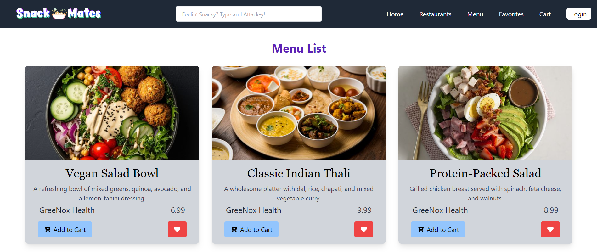

# SnackMates - Food Ordering Platform

SnackMates is a responsive web application designed to offer a seamless food ordering experience. Users can browse menus from various restaurants, add items to their cart or favorites, and manage their orders. The app is built with React.js and Tailwind CSS, using Vite as the build tool.

## Features

- **Homepage**: Displays a list of restaurants and a horizontally scrollable menu type selector.
- **Menu Page**: Allows users to view and interact with a restaurant’s menu, including adding items to the cart or favorites.
- **Favorites Page**: Shows a user's favorite menu items with options to manage them.
- **Login Page**: User authentication via email/password or Google OAuth.
- **Cart Management**: Add and remove items, and view the cart summary.
- **Dynamic API Integration**: Fetch data from backend APIs for dynamic content display.
- **Responsive Design**: Optimized for both mobile and desktop views.

## Technologies Used

- **Frontend**: React.js, JSX
- **Build Tool**: Vite
- **Styling**: Tailwind CSS
- **API Integration**: Axios
- **State Management**: React hooks (`useState`, `useEffect`)
- **Routing**: React Router (`react-router-dom`)
- **Icons**: React Icons (`react-icons/fa`)

## Setup and Installation

### Prerequisites

Ensure you have Node.js and Git installed on your machine.

### Installation Steps

1. Clone the repository:
   ```bash
   git clone https://github.com/Pragati-C19/SnackMates-Client.git
   cd SnackMates-Client
   ```
2. Install the project dependencies:
   ```bash
   npm install
   ```
3. Start the development server:
   ```bash
   npm run dev
   ```
   This will run the app in development mode. Open `http://localhost:3000` to view it in the browser.

## Project Components

### API Integration

APIs are managed in the `api-calls/` directory and are imported into components or custom hooks as needed. Axios is used to handle HTTP requests, providing functions for tasks like authentication, fetching menu data, and managing the cart.

### Custom Hooks

Custom hooks simplify the logic and state management across different components:
- **useMenu**: Fetches all menu items or those filtered by restaurant ID.
- **useCart**: Handles adding, removing, and clearing items from the user's cart.
- **useFavorites**: Manages the user's favorite menu items.
- **useAuth**: Manages user authentication state and interactions.

### State Management

State is managed using React's `useState` and `useEffect` hooks, which are integrated into custom hooks to keep the logic encapsulated and reusable across components.

## Routing

React Router (`react-router-dom`) is used for handling navigation across different pages:
- **HomePage**: Accessible via `/`, the landing page of the app.
- **MenuPage**: Accessible via `/menu`, displays menu items.
- **FavoritesPage**: Accessible via `/favorites`, shows the user's favorites.
- **LoginPage**: Accessible via `/login`, handles user authentication.

## Styling

Tailwind CSS is the primary styling framework used. Custom CSS is also added for specific components, such as the scroll bar on the homepage. Configuration files like `tailwind.config.js` allow for further customization.

## Images and Assets

- All image assets are stored in the `imgs/` directory, organized by category (e.g., `food-menu/` for menu item images). These images are imported and used in various components throughout the app.

## Icons

- Icons are imported from `react-icons/fa` and used across the application for actions like adding/removing items from the cart or marking favorites.

## Figma Design

The SnackMates project was meticulously designed using Figma to ensure a seamless user experience and an intuitive interface. The design captures the essence of a modern food ordering platform, with a focus on ease of navigation, vibrant visuals, and responsive layouts. Each component, from the horizontal scroll menu to the cart and favorites page, has been thoughtfully crafted to align with user expectations. 

You can explore the complete Figma design, including detailed wireframes and prototypes, [by following this link](https://www.figma.com/design/973SBdtYStD4fpFDna1pGQ/SnackMates%F0%9F%A5%99?node-id=0-1&t=gpce5ya2DBJu7VCV-1). This design serves as the blueprint for the entire frontend development process, ensuring consistency and a clear vision throughout the project.

## UI Design

- **Home Page**


- **Restaurants Page**


- **Menu Page**


- **Login Page**


- **Favorites Page**


- **Cart Page**


- **Checkout Modal**


## Contributing

- Contributions are welcome! Please fork this repository and submit pull requests for any enhancements or bug fixes.
